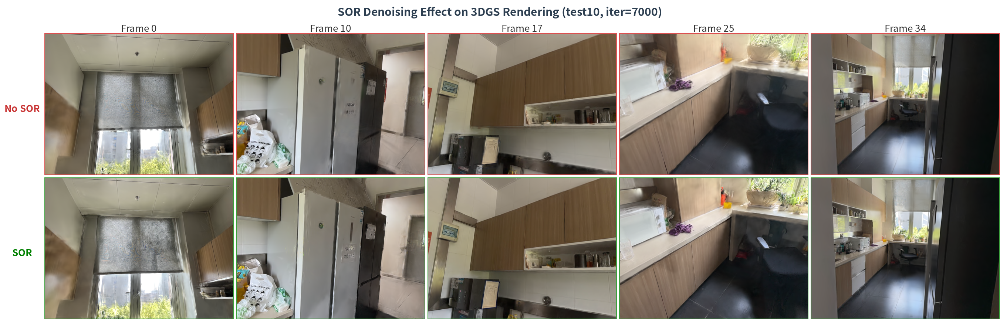
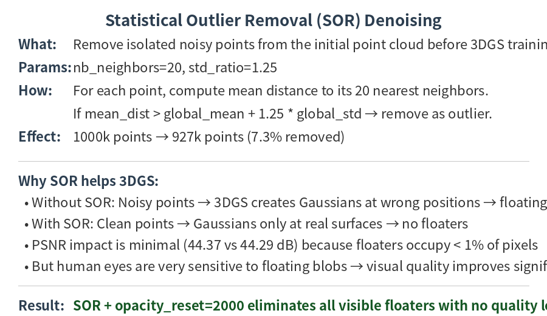
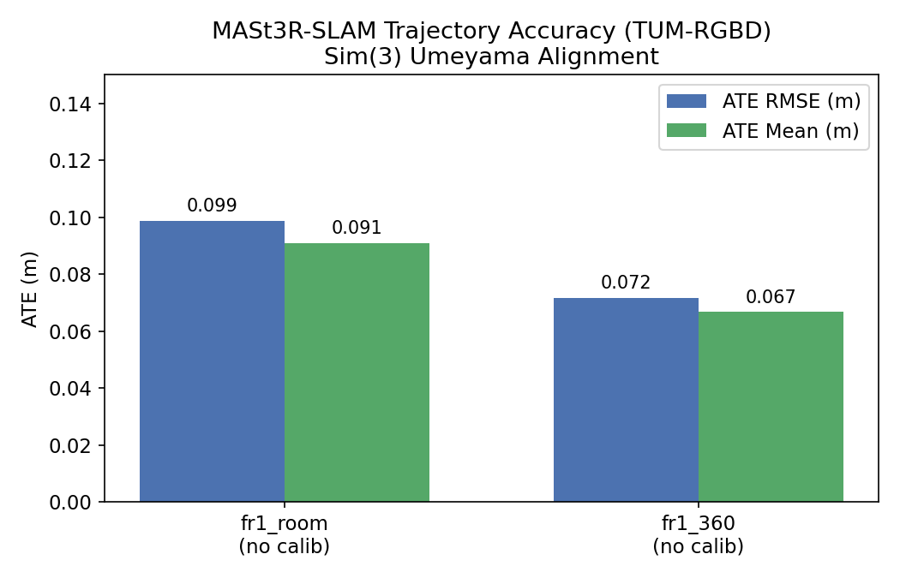
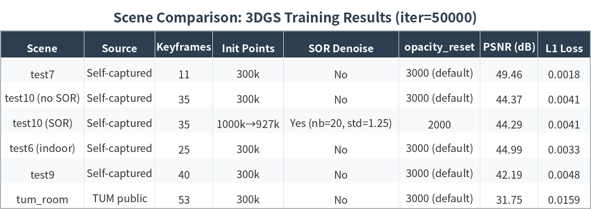
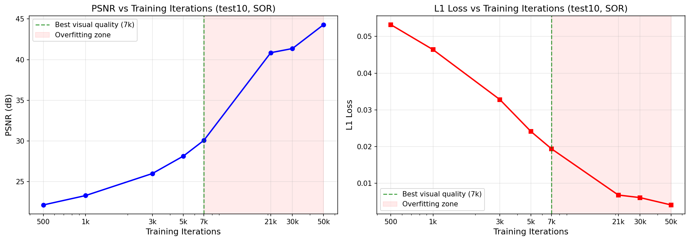
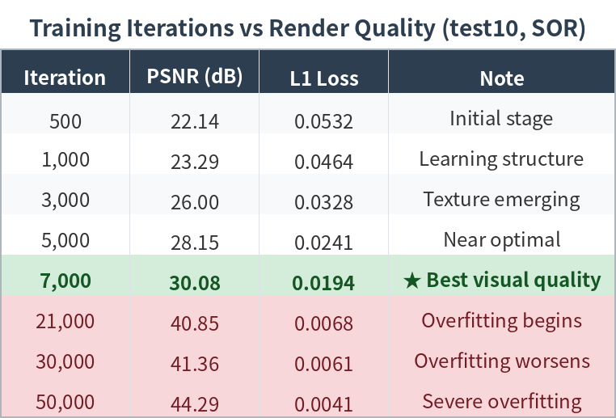
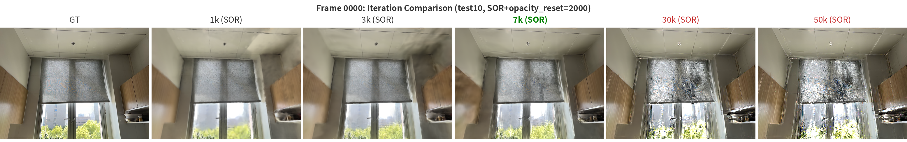
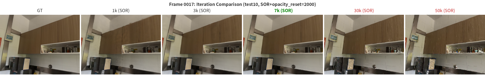
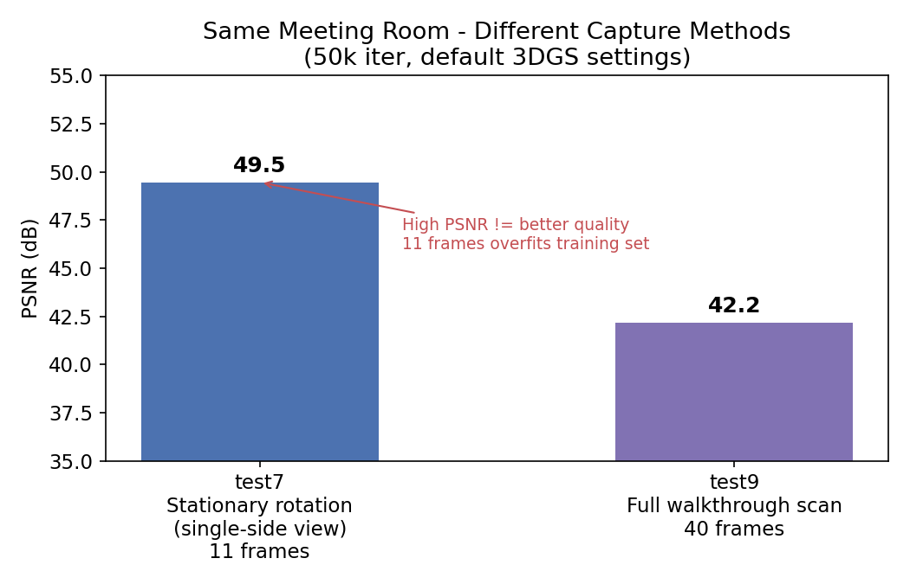

# SplatSLAM

**Dense 3D Reconstruction from Monocular Video via Learning-based SLAM and Gaussian Splatting**

Project page: https://sites.google.com/view/splatslam/home

SplatSLAM is an end-to-end pipeline for dense 3D reconstruction and novel view synthesis from monocular video. It uses **MASt3R-SLAM** to estimate camera trajectories and dense point clouds, applies our project-specific point-cloud refinement such as **Statistical Outlier Removal (SOR)**, converts the result to a COLMAP / 3DGS-compatible format, and trains **3D Gaussian Splatting** for photo-realistic rendering.

## Highlights

- **Three input modes:** public datasets, RGB-only video, and iPhone Spectacular Rec captures.
- **Learning-based SLAM frontend:** MASt3R-SLAM estimates camera trajectory and dense colored point cloud from monocular RGB input.
- **Our own post-processing:** MASt3R-to-3DGS conversion, coordinate conversion, point cloud filtering, and SOR denoising.
- **3DGS rendering:** refined point cloud initializes 3D Gaussians for novel view synthesis.
- **Practical finding:** for small self-captured scenes, 7k 3DGS iterations can look better than 30k / 50k because longer training may overfit keyframe details.

---

## Pipeline

```text
Input data
  ├── TUM-RGBD / 7-Scenes / other public datasets
  ├── RGB-only monocular video
  └── iPhone Spectacular Rec capture with RGB + camera metadata
        ↓
Data preprocessing
  ├── frame extraction
  ├── timestamp / filename standardization
  └── optional intrinsics from metadata
        ↓
MASt3R-SLAM
  ├── transformer-based dense matching
  ├── global bundle adjustment
  └── outputs: camera trajectory + dense point cloud
        ↓
SplatSLAM refinement
  ├── MASt3R trajectory to COLMAP / 3DGS camera format
  ├── point cloud downsampling / standardization
  └── SOR denoising for anti-floater rendering
        ↓
3D Gaussian Splatting
  ├── initialize Gaussians from refined point cloud
  ├── optimize position / covariance / opacity / color
  └── render novel views
```

---

## Our contributions

This repository does **not** vendor the original MASt3R-SLAM or 3DGS code. Those are third-party dependencies. Our own contributions are organized in `splatslam/` and `scripts/`.

### 1. MASt3R-SLAM to 3DGS conversion

File: `splatslam/export_mast3r_to_3dgs.py`

It converts MASt3R-SLAM outputs into a COLMAP-style folder expected by 3DGS:

```text
images/
sparse/0/cameras.txt
sparse/0/images.txt
sparse/0/points3D.txt
sparse/0/points3D.ply
```

It handles timestamp matching, camera pose conversion from `T_wc` to `T_cw`, focal length estimation, explicit intrinsics, and point downsampling.

### 2. SOR point-cloud denoising

File: `splatslam/sor_denoise.py`

SOR means **Statistical Outlier Removal**. For each 3D point, we compute the average distance to its nearest neighbors. If the distance is much larger than the global average, the point is treated as an isolated outlier and removed.

In our test10 scene, SOR filtered approximately `1000k → 927k` points. PSNR barely changed, but visual floaters were reduced.





---

## Experimental results

### MASt3R-SLAM trajectory benchmark

| Sequence | ATE RMSE (m) | ATE Mean (m) | ATE Median (m) | ATE Max (m) | ATE Std (m) |
|---|---:|---:|---:|---:|---:|
| fr1_room | 0.0987 | 0.0909 | 0.0881 | 0.1784 | 0.0385 |
| fr1_360 | 0.0717 | 0.0667 | 0.0630 | 0.1450 | 0.0262 |



`fr1_360` is easier because the camera mostly rotates in place. `fr1_room` has larger translation and stronger accumulated drift.

### Scene-level 3DGS results



Self-captured scenes generally produce higher PSNR than TUM room because they have slower camera motion and less motion blur. However, high training PSNR does not always mean better novel-view generalization.

### Training convergence and overfitting









For test10, around **7k iterations** gives the best visual quality. Although 30k / 50k have higher PSNR on training frames, they show overfitting artifacts around high-frequency textures such as curtains.

### Capture strategy comparison



Short in-place rotation can produce very high training PSNR because the model memorizes a few similar views. Wider scene scanning is more useful for complete reconstruction and novel-view robustness.

---

## Installation

Clone this repository:

```bash
git clone https://github.com/jessielijc/SplatSLAM.git
cd SplatSLAM
pip install -r requirements.txt
```

Install third-party dependencies separately:

- MASt3R-SLAM: https://github.com/rmurai0610/MASt3R-SLAM
- 3D Gaussian Splatting: https://github.com/graphdeco-inria/gaussian-splatting

Recommended workspace layout:

```text
workspace/
├── SplatSLAM/
├── MASt3R-SLAM/
├── gaussian-splatting/
└── data/
```

---

## Reproduce with your own data

Enter the repository:

```bash
cd workspace/SplatSLAM
```

### Input type 1: public datasets, e.g. TUM-RGBD / 7-Scenes

Put your dataset under:

```text
data/tum_room/
```

Run:

```bash
bash scripts/run_mast3r_slam.sh ../MASt3R-SLAM ../data/tum_room outputs/mast3r/tum_room
bash scripts/convert_to_3dgs.sh outputs/mast3r/tum_room outputs/3dgs/tum_room_dataset tum_room 300000
python -m splatslam.sor_denoise --sparse_dir outputs/3dgs/tum_room_dataset/sparse/0 --nb_neighbors 20 --std_ratio 1.25
bash scripts/run_3dgs_training.sh ../gaussian-splatting outputs/3dgs/tum_room_dataset outputs/3dgs/tum_room_model 7000
bash scripts/render_3dgs.sh ../gaussian-splatting outputs/3dgs/tum_room_model 7000
```

### Input type 2: RGB-only video

Put your video under:

```text
data/videos/my_room.mp4
```

Run:

```bash
bash scripts/run_mast3r_slam.sh ../MASt3R-SLAM ../data/videos/my_room.mp4 outputs/mast3r/my_room
bash scripts/convert_to_3dgs.sh outputs/mast3r/my_room outputs/3dgs/my_room_dataset my_room 300000
python -m splatslam.sor_denoise --sparse_dir outputs/3dgs/my_room_dataset/sparse/0 --nb_neighbors 20 --std_ratio 1.25
bash scripts/run_3dgs_training.sh ../gaussian-splatting outputs/3dgs/my_room_dataset outputs/3dgs/my_room_model 7000
bash scripts/render_3dgs.sh ../gaussian-splatting outputs/3dgs/my_room_model 7000
```

### Input type 3: iPhone Spectacular Rec capture

Example layout:

```text
data/spectacular_rec/test10/
├── video.mp4
├── frames/                 # optional extracted frames
└── camera_metadata.json    # optional intrinsics / metadata
```

If you know the intrinsics, pass them explicitly:

```bash
bash scripts/run_mast3r_slam.sh ../MASt3R-SLAM ../data/spectacular_rec/test10/video.mp4 outputs/mast3r/test10

python scripts/export_mast3r_to_3dgs.py \
  --source outputs/mast3r/test10 \
  --output outputs/3dgs/test10_dataset \
  --scene test10 \
  --max-points 1000000 \
  --fx 1500 --fy 1500 --cx 960 --cy 540

python -m splatslam.sor_denoise --sparse_dir outputs/3dgs/test10_dataset/sparse/0 --nb_neighbors 20 --std_ratio 1.25
bash scripts/run_3dgs_training.sh ../gaussian-splatting outputs/3dgs/test10_dataset outputs/3dgs/test10_model 7000
bash scripts/render_3dgs.sh ../gaussian-splatting outputs/3dgs/test10_model 7000
```

If you do not use explicit intrinsics, estimate focal length from FOV:

```bash
python scripts/export_mast3r_to_3dgs.py \
  --source outputs/mast3r/test10 \
  --output outputs/3dgs/test10_dataset \
  --scene test10 \
  --max-points 1000000 \
  --fov-x 60
```

---

## Included self-captured example datasets

This repository includes three representative self-captured example datasets:

- `test6`: indoor scene
- `test9`: SUSTech outdoor scene
- `test10`: tearoom / iPhone-style capture

They are organized in two forms:

```text
examples/datasets/
├── mast3r_slam/
│   ├── test6/      # MASt3R-SLAM outputs: keyframes + trajectory + point cloud
│   ├── test9/
│   └── test10/
└── 3dgs/
    ├── test6_dataset/   # converted COLMAP / 3DGS datasets
    ├── test9_dataset/
    └── test10_dataset/
```

### Option 1: start from included MASt3R-SLAM outputs

This tests our conversion + denoising + 3DGS training pipeline. The normalized `test6` and `test10` folders contain keyframes, trajectory, and point cloud files with matching scene names.

```bash
bash scripts/convert_to_3dgs.sh examples/datasets/mast3r_slam/test10 outputs/3dgs/test10_dataset test10 1000000
python -m splatslam.sor_denoise --sparse_dir outputs/3dgs/test10_dataset/sparse/0 --nb_neighbors 20 --std_ratio 1.25
bash scripts/run_3dgs_training.sh ../gaussian-splatting outputs/3dgs/test10_dataset outputs/3dgs/test10_model 7000
bash scripts/render_3dgs.sh ../gaussian-splatting outputs/3dgs/test10_model 7000
```

For test6, replace `test10` with `test6`.

`test9` is included mainly as a 3DGS-ready dataset because its compact MASt3R-SLAM export in this workspace does not include the original timestamped keyframe folder.

### Option 2: start from included 3DGS-ready datasets

This directly tests 3DGS training and rendering.

```bash
bash scripts/run_3dgs_training.sh ../gaussian-splatting examples/datasets/3dgs/test10_dataset outputs/3dgs/test10_model 7000
bash scripts/render_3dgs.sh ../gaussian-splatting outputs/3dgs/test10_model 7000
```

> Important: these example datasets contain `.ply` point clouds, including files close to or above GitHub's normal 100MB limit. This repository is configured with Git LFS through `.gitattributes`. Before pushing, run `git lfs install` and `git lfs track "*.ply"`.

---

## Repository structure

```text
SplatSLAM/
├── splatslam/              # project-specific modules
├── scripts/                # runnable workflow scripts
├── configs/                # example configs
├── docs/assets/            # figures and tables
├── examples/datasets/      # test6 / test9 / test10 example datasets
├── examples/videos/        # optional raw videos
├── third_party/            # dependency notes
├── requirements.txt
└── README.md
```

---

## Acknowledgements

This project builds on MASt3R-SLAM, 3D Gaussian Splatting, Open3D, TUM-RGBD, and 7-Scenes.

## License

This repository contains our SplatSLAM glue code, conversion scripts, point-cloud post-processing, and documentation. Third-party repositories have their own licenses and should be installed separately.
